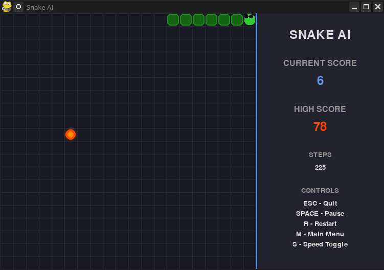

# 🐍 Snake AI - Genetic Algorithm Neural Network

[](https://python.org)
[](https://gcc.gnu.org)
[](https://pygame.org)
[](https://numpy.org)


## 👁️ Preview


## 🎯 Overview

This project implements an AI-powered Snake game where neural networks learn to play through evolutionary algorithms. The AI starts with random behavior and gradually evolves over generations to become an expert Snake player, demonstrating the power of genetic algorithms and neural networks in game AI.

### 🌟 Key Features

- **🧠 Neural Network AI**: Feed-forward neural network that learns game strategies
- **🧬 Genetic Algorithm**: Evolutionary approach for training without traditional backpropagation
- **🎮 Interactive Gameplay**: Beautiful modern UI with real-time visualization
- **📊 Performance Tracking**: Detailed fitness metrics and generation statistics
- **💾 Model Persistence**: Save and load trained models for future use
- **🎨 Modern Design**: Clean, responsive interface with smooth animations
- **⚡ Configurable Speed**: Adjustable game speed for training and demonstration

## 🚀 Quick Start

### Prerequisites

#### For Python Version
- Python 3.8 or higher
- pip package manager

#### For C++ Version (Optional - for high-performance training)
- GCC compiler with C++11 support
- Make build system

### Installation

1. **Clone the repository**
   ```bash
   git clone https://github.com/MihailoVukorep/oi_proj.git
   cd oi_proj
   ```

2. **Set up Python environment and install dependencies**
   ```bash
   # Using the provided setup script
   bash setup-env.sh
   
   # Or manually:
   python -m venv .venv
   .venv\Scripts\activate
   pip install -r requirements.txt
   ```

3. **Run the application**
   ```bash
   python learn.py
   ```

## 🎮 How to Use

### Training a New AI Model

1. Launch the application: `python learn.py`
2. Select **"New Game (Train AI)"** from the main menu
3. Watch as the genetic algorithm evolves the neural network for "X" generations
4. The best performing model will be automatically saved
5. After training, observe the AI play in real-time visualization

### Loading and Testing Existing Models

1. Select **"Load Model & Play"** from the main menu
2. The AI will demonstrate its learned behavior
3. Use controls to interact with the demonstration

### Controls

| Key | Action |
|-----|--------|
| `ESC` | Quit application |
| `SPACE` | Pause/Resume game |
| `R` | Restart current game |
| `M` | Return to main menu |
| `S` | Toggle game speed (30/60/120/240/480/960 FPS) |
| `T` | Train new model (when in game over screen) |

## 🏗️ Architecture

### Project Structure

```
oi_proj/
├── src/
│   ├── game.py          # Core game logic and state management
│   ├── snake.py         # Snake entity with movement and collision detection
│   ├── network.py       # Neural network implementation
│   ├── genetic.py       # Genetic algorithm for evolution
│   ├── ui.py            # User interface and rendering
│   ├── menu.py          # Main menu system
│   └── globals.py       # Game constants and configuration
├── models/
│   └── best_model.json  # Saved neural network weights
├── preview/
│   └── preview.gif      # Demo animation
├── learn.py             # Main Python application entry point
├── learn.cpp            # Single-threaded C++ implementation
├── learn_mt.cpp         # Multi-threaded C++ implementation
├── Makefile             # Build system for C++ versions
├── setup-env.sh         # Environment setup script
├── requirements.txt     # Python dependencies
└── README.md            # Project documentation
```

### Neural Network Architecture

```
Input Layer (11 neurons)
    ├── Danger Detection (3): straight, left, right
    ├── Current Direction (4): up, down, left, right
    └── Food Location (4): up, down, left, right relative to head
              ↓
Hidden Layer (16 neurons with tanh activation)
              ↓
Output Layer (4 neurons)
    └── Actions: up, down, left, right
```

### Genetic Algorithm Parameters

| Parameter | Set Value | Description |
|-----------|---------------|-------------|
| Population Size | 300 | Number of networks per generation |
| Mutation Rate | 0.2 | Probability of weight mutation |
| Mutation Strength | 0.2 | Magnitude of weight changes |
| Generations | 1000 | Default training iterations |
| Elite Preservation | Yes | Best network always survives |

## 📊 Fitness Evaluation

The genetic algorithm uses a sophisticated fitness function that considers multiple factors:

### Primary Metrics
- **Score (Exponential)**: Exponential reward for food consumption
- **Survival Time**: Bonus for staying alive longer
- **Food Approach**: Reward for moving toward food
- **Danger Avoidance**: Bonus for avoiding walls and self-collision

### Advanced Metrics
- **Efficiency**: Steps-to-food ratio optimization
- **Exploration**: Penalty for repetitive movement patterns
- **Risk Management**: Reward for escaping dangerous situations
- **Consistency**: Bonus for stable performance across multiple games

### Fitness Formula
```python
final_fitness = exponential_score_reward + 
                survival_bonus + 
                food_approach_bonus + 
                danger_avoidance_bonus + 
                efficiency_bonus + 
                consistency_bonus
```

## 🔧 Configuration

### Game Settings (globals.py)

```python
GRID_SIZE = 20  
GRID_WIDTH = 35       
GRID_HEIGHT = 35      
CELL_SIZE = 25       
GAME_AREA_WIDTH = GRID_WIDTH * CELL_SIZE
GAME_AREA_HEIGHT = GRID_HEIGHT * CELL_SIZE
UI_WIDTH = 250
WINDOW_WIDTH = GAME_AREA_WIDTH + UI_WIDTH
WINDOW_HEIGHT = GAME_AREA_HEIGHT

# Colors and Directions are also defined in globals.py
# ...

# Directions
UP = (0, -1)
DOWN = (0, 1)
LEFT = (-1, 0)
RIGHT = (1, 0)
DIRECTIONS = [UP, DOWN, LEFT, RIGHT]
```

### Customizing Training

Modify training parameters in `learn.py`:

```python
# Adjust generation count
best_network = train_snake_ai(generations=100)

# Modify genetic algorithm parameters
ga = GeneticAlgorithm(
    population_size=150,
    mutation_rate=0.15,
    mutation_strength=0.3
)
```

## 📚 Technical Deep Dive

### Genetic Algorithm Implementation

The genetic algorithm follows a standard evolutionary approach:

1. **Initialization**: Create random population of neural networks
2. **Evaluation**: Test each network's performance using fitness function
3. **Selection**: Choose parents using tournament selection
4. **Crossover**: Combine parent networks to create offspring
5. **Mutation**: Apply random changes to maintain genetic diversity
6. **Replacement**: Form new generation with elite preservation

### Neural Network Details

The feed-forward network processes game state through:

1. **State Extraction**: Convert game board to numerical features
2. **Feature Engineering**: Relative positions, danger detection, direction encoding
3. **Forward Propagation**: Transform input through hidden layers
4. **Action Selection**: Choose movement direction from output probabilities

### Game State Representation

The neural network receives 11 input features:

```python
state = [
    danger_straight,    # Collision risk ahead
    danger_left,        # Collision risk to left
    danger_right,       # Collision risk to right
    direction_up,       # Currently moving up
    direction_down,     # Currently moving down
    direction_left,     # Currently moving left
    direction_right,    # Currently moving right
    food_up,            # Food is above snake
    food_down,          # Food is below snake
    food_left,          # Food is left of snake
    food_right          # Food is right of snake
]
```

## 🚀 High-Performance C++ Implementation

For faster training, the project includes optimized C++ implementations:

### Available Builds

- **`learn.cpp`**: Single-threaded C++ implementation
- **`learn_mt.cpp`**: Multi-threaded C++ implementation for maximum performance

## 📁 Model Management

Trained models are automatically saved in the `models/` directory:
- `best_model.json` - Latest best performing model
- `pop_X_gen_Y.json` - Checkpoint models during training

The models use JSON format for cross-compatibility between Python and C++ implementations.

## 🎯 Tips for Better Training

1. **Start with Python**: Use the Python version for initial experimentation and visualization
2. **Scale with C++**: Switch to C++ implementations for serious training sessions
3. **Population Size**: Larger populations (300-500) generally produce better results
4. **Patience**: Good models typically emerge after 500-1000 generations